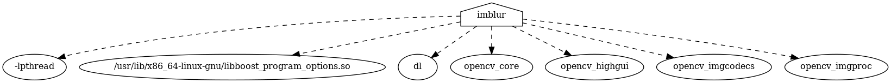

# Screen-locker
 

An incredibly heavy implementation of a program to take a screencap, blur it, and lock the session using said image as the lockscreen background. 

The core program is outlined in main.cpp and provides the imblur executable. 
## Installation

## Dependencies
1) `imlib2` tp use the `imlib2_grab` function. Any drop-in replacement should be fine. We just need the image. 
2) `i3lock` or similar screen-locker that can accept an image to be used as background. See [`screen-lock`](./screen-lock) and replace `i3lock` with its associated syntax with your screen locker of choice.
3) See [Dockerfile](./Dockerfile) for a minimal ubuntu installation example.
    - This project requires the following packages:
        - boost : `apt install libboost-all-dev`
        - OpenCV: `apt install libopencv-dev` 

